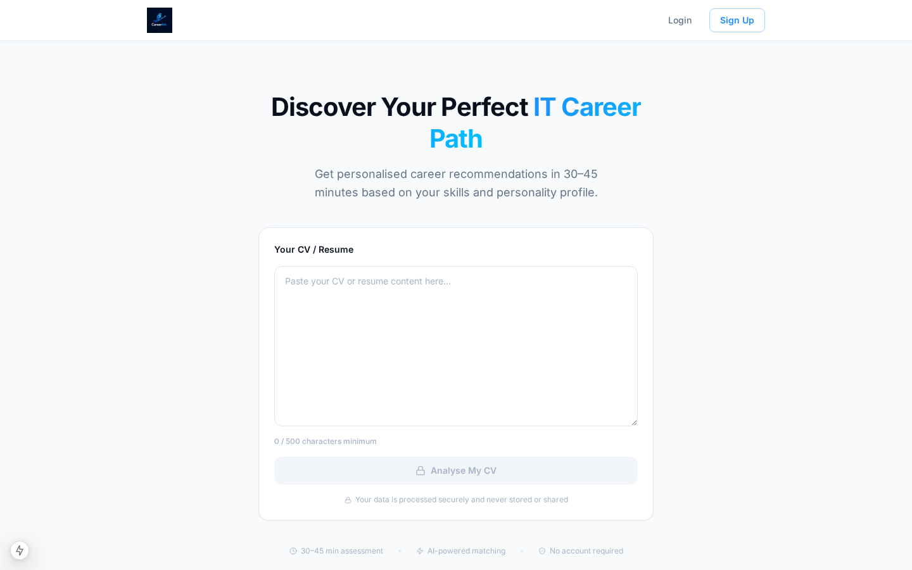
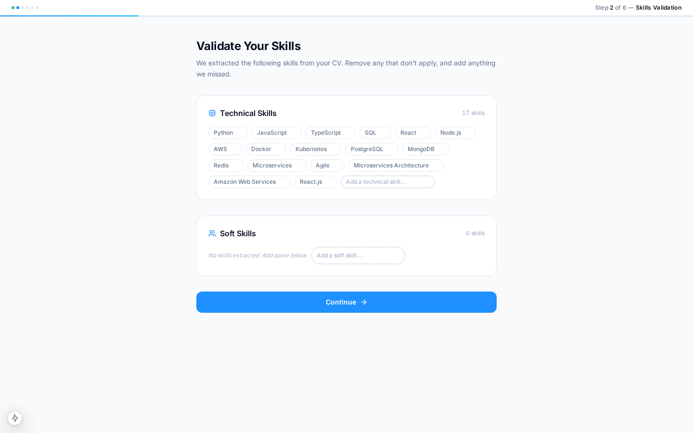
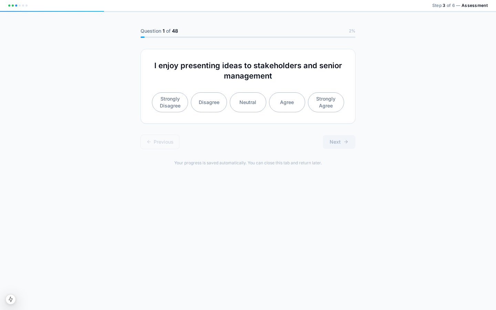
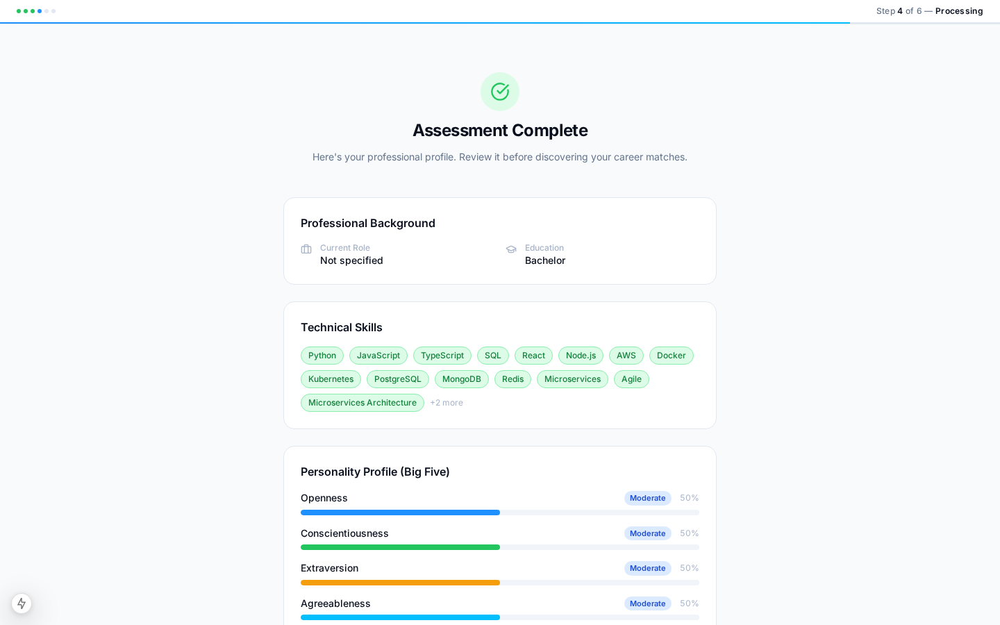
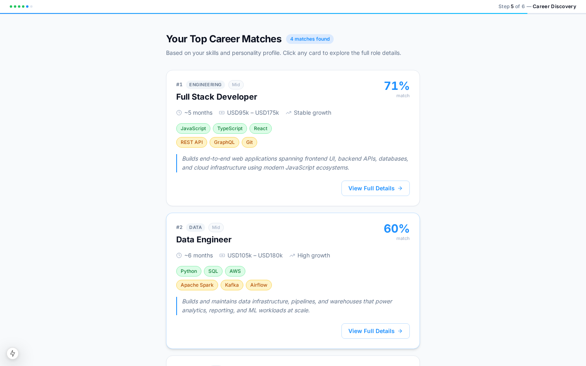
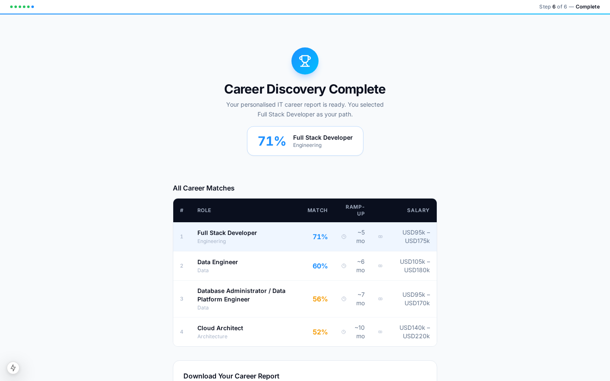

<p align="center">
  
</p>

<h1 align="center">CareerInk</h1>
<p align="center"><strong>AI-Powered IT Career Transition Platform</strong></p>
<p align="center">
  From career confusion to clear career direction — in 30–45 minutes.
</p>

<p align="center">
  <a href="https://07sh1vso.run.complete.dev/" target="_blank">
    
  </a>
</p>

---

## 🌐 Live Demo

**[https://07sh1vso.run.complete.dev/](https://07sh1vso.run.complete.dev/)**

---

## Overview

CareerInk is a full-stack AI application that analyses your CV and personality profile to match you with the most suitable IT career paths from a curated library of 50 role prospect reports. It generates a personalised PDF report with detailed role overviews, required skills, salary bands, and career progression paths.

---

## User Journey — Step by Step

### Step 1 — Upload Your CV

Paste your CV text into the analysis box. The AI (Agent 1) extracts your hard skills, soft skills, experience, and career goals automatically.



---

### Step 2 — Confirm Your Skills

Review and confirm the skills extracted from your CV. Add or remove skills as needed before moving forward.



---

### Step 3 — Personality & Work Style Assessment

Complete a 48-question psychometric assessment covering the Big Five personality traits and Holland RIASEC work styles. This takes approximately 5–8 minutes.



---

### Step 4 — Your Professional Profile

Review your generated professional profile — personality traits, work style scores, and work values — before career matching begins.



---

### Step 5 — Your Career Matches

Agent 2 matches your profile against all 50 IT career roles using a weighted scoring algorithm (skills 40%, personality 25%, work style & values 20%, experience 15%). Each match shows:

- Match score (0–100%)
- Matched & gap skills
- Ramp-up time and salary range
- Full role detail panel with Role Overview, Key Responsibilities, Required Skills, Career Progression, Compensation bands, and What Makes a Great [Role]



---

### Step 6 — Download Your Report

Select your preferred career path and download a fully formatted A4 PDF report with all career details, your professional profile summary, and personalised next steps.



---

## Tech Stack

| Layer | Technology |
|---|---|
| Frontend | Next.js 15, React, TypeScript, Tailwind CSS |
| Backend | FastAPI, Python 3.11, LangGraph |
| AI Agents | Deploy AI (GPT-4o), LangGraph state machines |
| PDF Generation | ReportLab |
| Assessment | Big Five (OCEAN) + Holland RIASEC (48 questions) |
| Matching Algorithm | Weighted multi-factor scoring across 50 IT career profiles |

---

## Architecture

```
careerink/
├── backend/
│   ├── agents/
│   │   ├── agent1/        # CV parsing & skill extraction (LangGraph)
│   │   └── agent2/        # Career matching & justification (LangGraph)
│   ├── data/
│   │   ├── career_profiles.py          # 50 structured career profiles
│   │   ├── career_reports_content.py   # Rich content from .docx reports
│   │   ├── career_reports/             # 50 original .docx source files
│   │   └── questions.py                # 48 psychometric questions
│   ├── services/
│   │   ├── cv_parser.py       # CV text extraction & skill parsing
│   │   ├── matcher.py         # Weighted career matching algorithm
│   │   ├── pdf_generator.py   # ReportLab PDF report builder
│   │   └── deploy_ai.py       # Deploy AI LLM integration
│   └── main.py                # FastAPI app & API routes
└── frontend/
    ├── src/app/               # Next.js App Router pages (6 steps)
    ├── src/components/        # Reusable UI components
    ├── src/lib/               # Zustand store & API client
    └── src/types/             # TypeScript interfaces
```

---

## Local Development

### Prerequisites

- Python 3.11+
- Node.js 18+
- npm

### Backend Setup

```bash
cd backend
python -m venv venv
source venv/bin/activate        # Windows: venv\Scripts\activate
pip install -r requirements.txt
cp .env.example .env            # Fill in your credentials
uvicorn main:app --host 0.0.0.0 --port 3007 --reload
```

### Frontend Setup

```bash
cd frontend
npm install
cp .env.example .env.local      # Fill in your credentials
npm run dev -- -p 3008
```

The app will be available at `http://localhost:3008`.

---

## Environment Variables

### Backend (`backend/.env`)

| Variable | Description |
|---|---|
| `CLIENT_ID` | Deploy AI OAuth2 client ID |
| `CLIENT_SECRET` | Deploy AI OAuth2 client secret |
| `AUTH_URL` | `https://api-auth.dev.deploy.ai/oauth2/token` |
| `API_URL` | `https://core-api.dev.deploy.ai` |
| `ORG_ID` | Deploy AI organisation ID |

### Frontend (`frontend/.env.local`)

| Variable | Description |
|---|---|
| `NEXT_PUBLIC_API_URL` | Public URL of the backend API |
| `BACKEND_INTERNAL_URL` | Internal backend URL (e.g. `http://localhost:3007`) |

---

## API Endpoints

| Method | Endpoint | Description |
|---|---|---|
| `POST` | `/api/agent1/analyze-cv` | Parse CV text, extract skills & metadata |
| `GET` | `/api/questions` | Fetch 48 psychometric assessment questions |
| `POST` | `/api/agent1/score-assessment` | Score Big Five + Holland RIASEC responses |
| `POST` | `/api/agent2/match-careers` | Match user profile against 50 career roles |
| `POST` | `/api/pdf/generate` | Generate personalised PDF career report |
| `GET` | `/health` | Health check |

---

## Career Database

50 IT career roles across 8 families:

`Engineering` · `Data` · `Architecture` · `Security` · `Management` · `Design` · `Consulting` · `Emerging Tech`

Each role includes a 10-year market outlook report (2025–2035) with role overview, responsibilities, required skills, career progression path, and compensation bands by seniority (Entry / Mid / Senior / Lead).

---

## Deployment

See [`GITHUB_VERCEL_DEPLOYMENT_GUIDE.md`](GITHUB_VERCEL_DEPLOYMENT_GUIDE.md) for step-by-step instructions to deploy the frontend to Vercel and the backend to Railway or Render.

---

<p align="center">
  Built with ❤️ by Team Jobonauts &nbsp;·&nbsp; Powered by CareerInk AI &nbsp;·&nbsp; careerink.io
</p>
